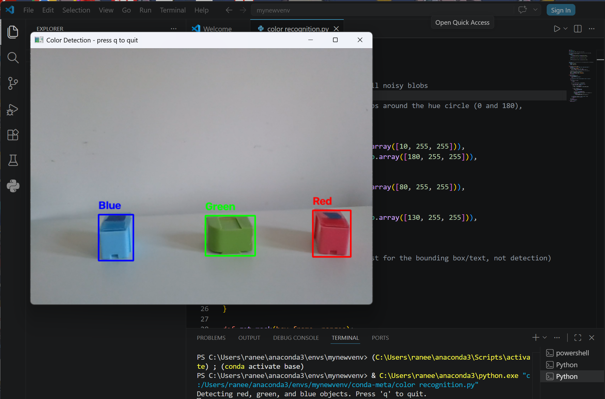

# Real-Time Color Detection (HSV + Contours)
 
Detects red, green, and blue objects live via webcam using HSV
color-space thresholding and contour detection.
 
## Demo
 

 
The screenshot above shows the script correctly detecting and labeling
all three colored objects in a single frame, with a bounding box and
color-coded label drawn over each one.
 
## Setup
 
```bash
pip install opencv-python numpy
```
 
(Plain `opencv-python` is fine here — no need for `opencv-contrib-python`,
since this doesn't use the `cv2.face` module.)
 
## Run
 
```bash
python color_detection.py
```
 
Hold up a red, green, or blue object to the camera. It'll be boxed with
a label. Press `q` to quit.
 
## How it works
 
1. **BGR → HSV conversion** — HSV separates hue (color) from brightness,
   so a red object stays "red" in hue whether it's brightly or dimly lit.
   That's much harder to threshold reliably in raw BGR/RGB.
2. **`cv2.inRange()`** — thresholds the HSV frame into a binary mask: white
   where pixels fall inside the target hue/saturation/value range, black
   elsewhere. Red needs *two* ranges combined, since hue is circular
   (0-180 in OpenCV) and red sits right at the wraparound point.
3. **Morphological cleanup** — `erode` then `dilate` remove small noisy
   specks and smooth out the mask before contour detection.
4. **`cv2.findContours()`** — finds the outlines of white blobs in the
   mask. Small contours (noise) are filtered out via `MIN_CONTOUR_AREA`;
   the rest get bounding boxes drawn on the original color frame.
